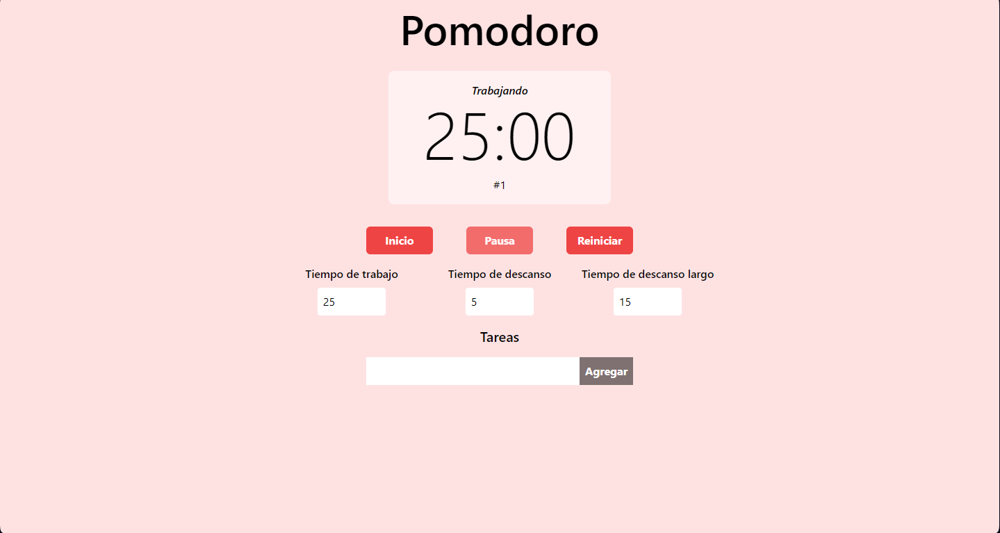

# Pomodoro App

Sencilla aplicacion de escritorio de pomodoro.

### Tecnologias utilizadas

- ElectronJS
- TailwindCSS
- JavaScript vanila

### Como ejecutar la aplicacion?

1. Descarga o clona el repositorio.
2. Asegurate de tener instalado nodeJS en su ultima version. Descarga node [aqui](https://nodejs.org/en)
3. Una vez instalado y clonado el repositorio, corre el comando `npm install`
4. Utiliza el script `npm run` para inicializar la aplicacion.

### Descargar la aplicacion directamente

Puedes descargar la aplicacion en el siguiente link

[PomodoroApp](https://mega.nz/file/sHcnVZwT#K6qs5gie5N03wXBfMAtHRLgzCexMoHRCpKkhoLNlqqM)
